# Anexos
## **([R25](https://github.com/alonsorgr/venenciame/issues/56)) Codeception**

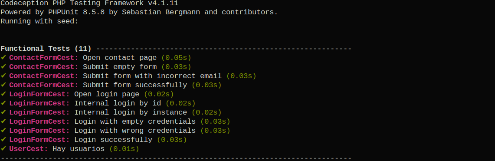

## **([R26](https://github.com/alonsorgr/venenciame/issues/57)) Code Climate**
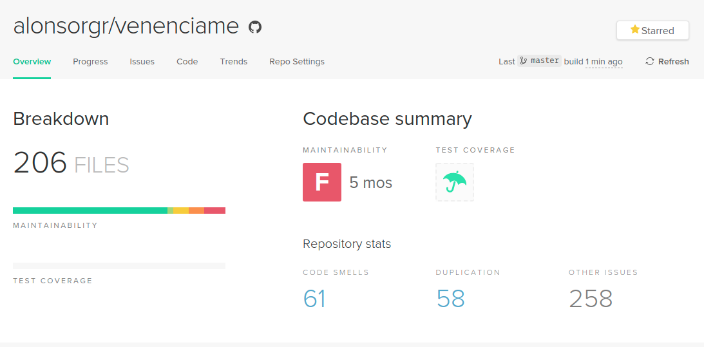

## **([R34](https://github.com/alonsorgr/venenciame/issues/65)) Validación HTML5, CSS3 y accesibilidad**

### Validación accesibilidad AA
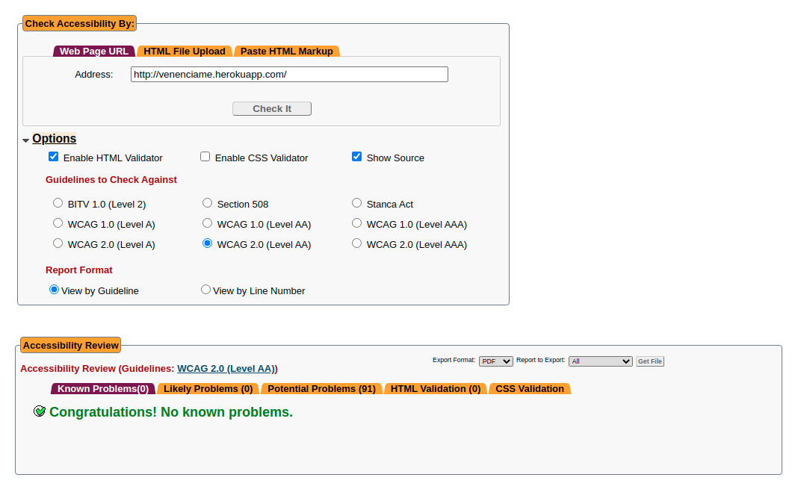
### Validación HTML
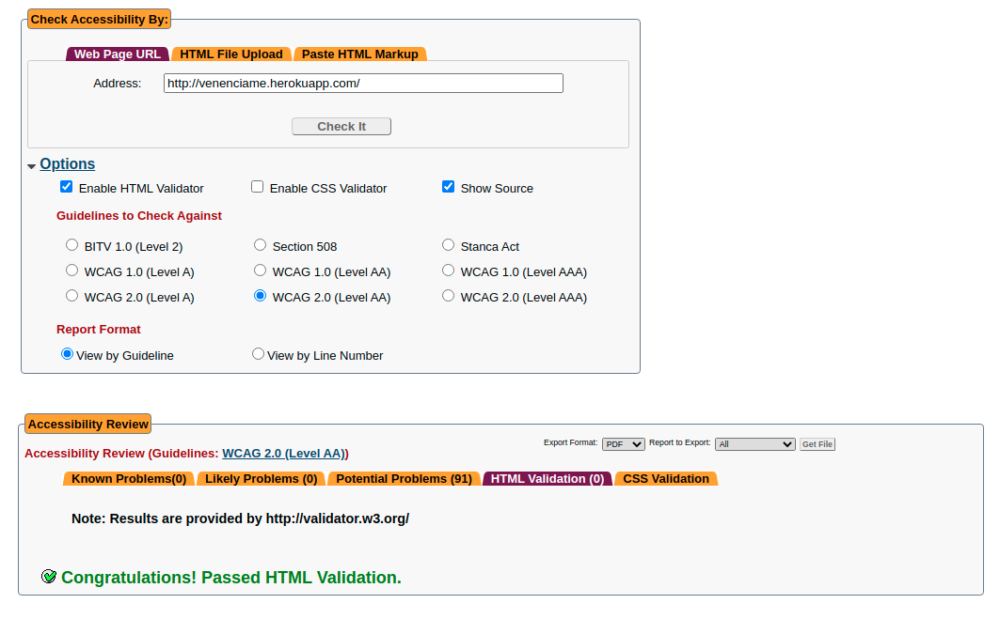

### Valicadión CSS
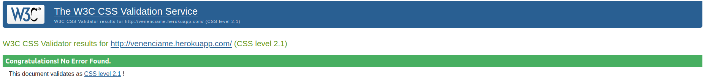

## **([R36](https://github.com/alonsorgr/venenciame/issues/67)) Varios navegadores**

### Google Chrome
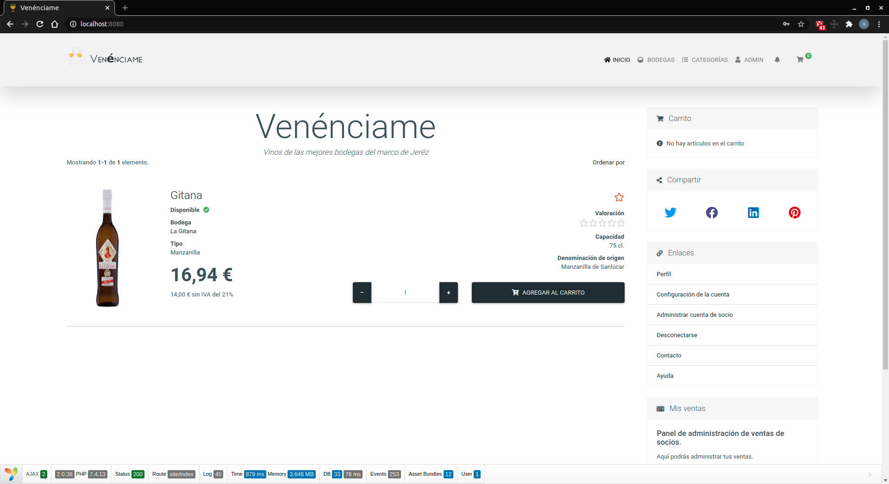

### Mozilla Firefox
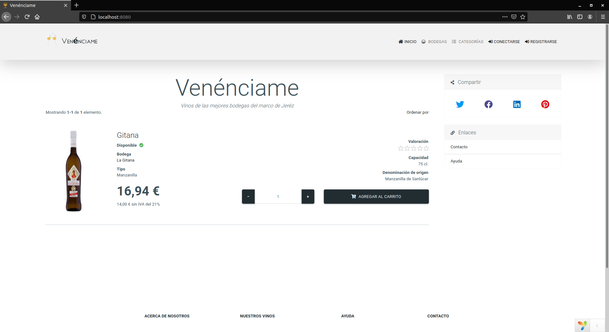

### Opera
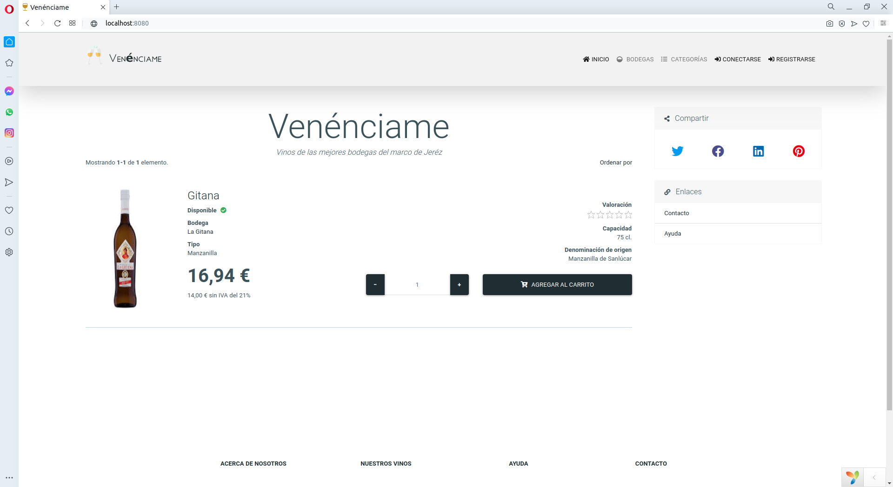

### Microsoft Edge
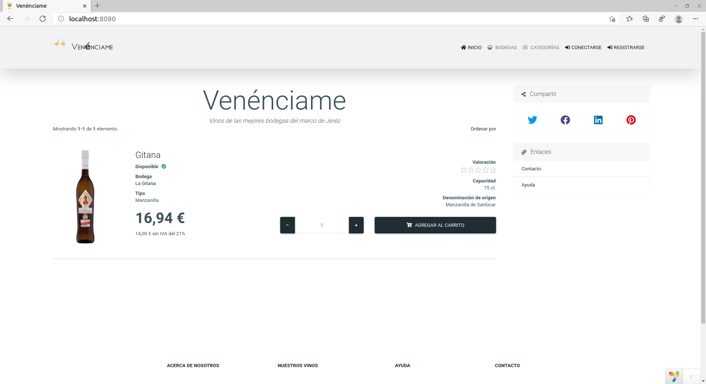
### Prueba del seis

1. ¿Qué sitio es éste?
    - En todo momento que el usuario navegue por la aplicación, podrá saber en qué sitio web se encuentra por el logo que siempre está presente en la barra de navegación.

2. ¿En qué página estoy?
    - En todo momento sabremos en qué página estamos gracias al componente de migas de pan.

3. ¿Cuáles son las principales secciones del sitio?
    - **Página de inicio**: es la página principal de la aplicación.
    - **Pagina de artículos**: es la página donde podremos navegar entre los distintos artículos en venta.
    - **Pagina de socios**: es la página donde se encuentra la información de los vendedores y sus productos en venta.
    - **Pagina de administración de socios**: es la página donde los socios podrán administrar sus artículos y ventas.
    - **Pagina de administración**: es la página donde los administradores de la aplicación podrán administrar el sitio web.
    - **Perfil de usuario**: página que se accede a través de un menú en la barra de navegación y donde se encuentra toda la información e iteracciones del usuario en el sitio web.

4. ¿Qué opciones tengo en este nivel?
    -   Tenemos la opción de filtrar artículos por tipo gracias al menú de categorías en la barra de navegación así como otro menú donde los usuarios podrán acceder a toda su información e iteracciones.
    Finalmente, los socios y administradores del sitio web, podrán administrar respectivamente los artículos y el sitio web.

5. ¿Dónde estoy en el esquema de las cosas?
    - Gracias a las migas de pan, podremos saber en qué sitio estamos siempre dentro del esquema de las cosas.

6. ¿Cómo busco algo?
    - En la sección de artículos, hay un buscador con diferentes filtros para poder buscar cualquier artículo en el sitio web.

## **([R38](https://github.com/alonsorgr/venenciame/issues/69)) Despliegue en servidor local**

### Configuración apache:

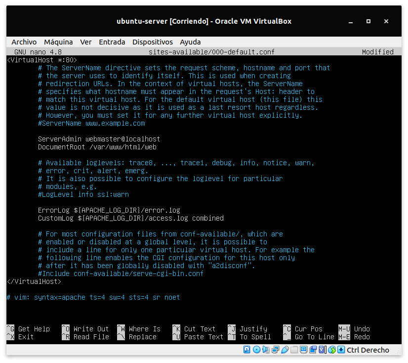

### Activar SSL
``$ sudo a2enmod ssl``

``$ sudo a2ensite default-ssl``

``$ sudo openssl genrsa -des3 -out server.key 2048``

`` sudo openssl req -new -key server.key -out server.csr``

``$ sudo openssl x509 -req -days 365 -in server.csr -signkey server.key -out server.crt``

``$ sudo cp server.crt /etc/ssl/certs/``

``$ sudo cp server.key /etc/ssl/private/``

``$ sudo service apache2 restart``

### Configuración de Red:

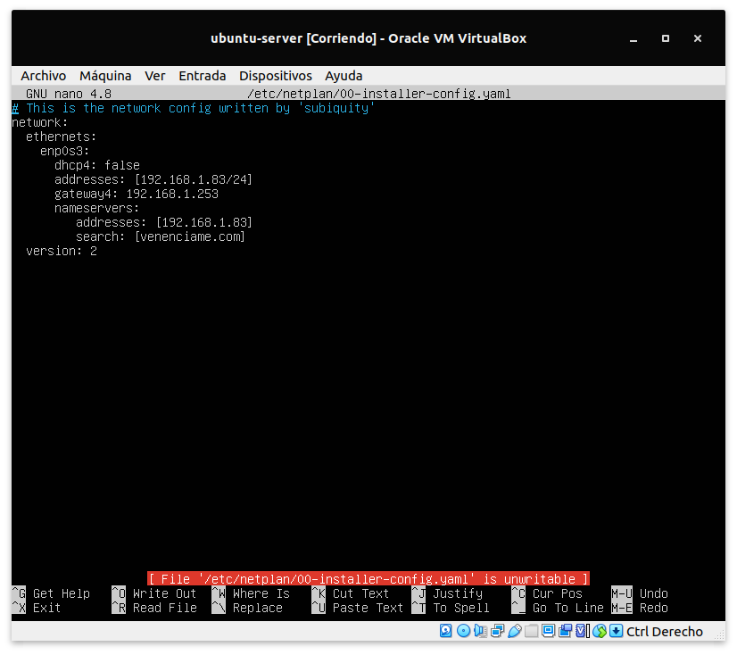

### Configuración DNS

named.conf.local

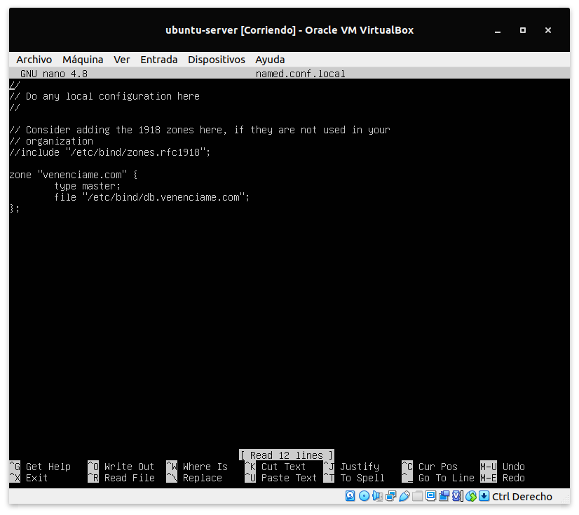

db.venenciame.com

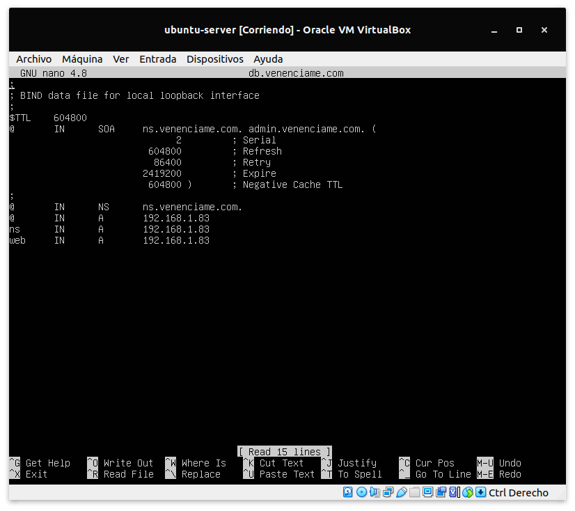

### Test

