# Manual de usuario

Al entrar en la aplicación, nos encontraremos con la pantalla de inicio.

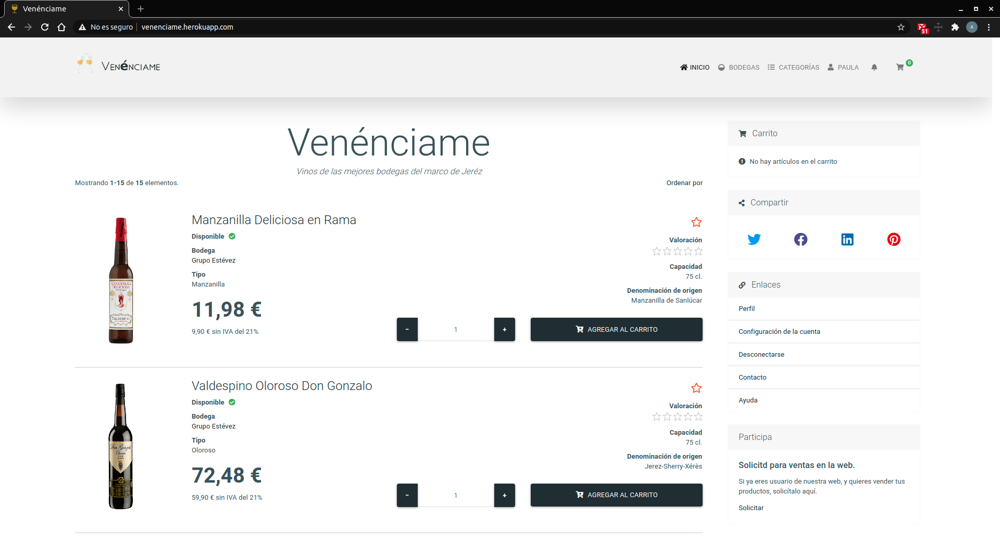

En la siguiente pantalla, verémos el proceso de conexión a la web, accediendo desde el menú de la barra superior, en la parte derecha "Conectarse".

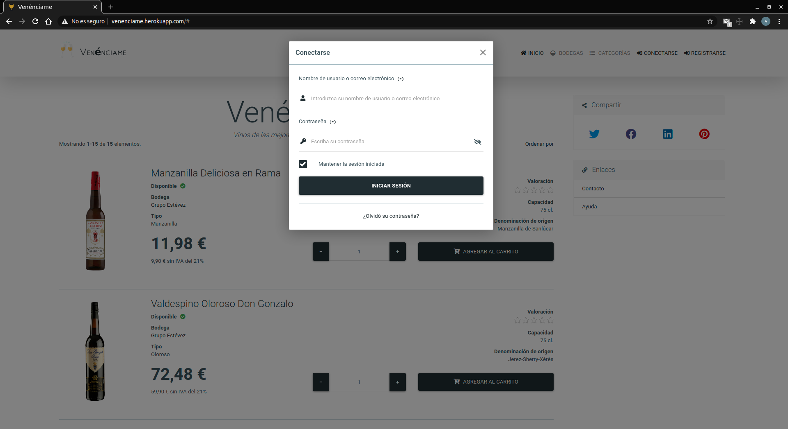

Si ha olvidado su contraseña, puede acceder al mecanísmo de recuperación de contraseña accediendo desde el enlace que hay debajo del botón de inicio de sesión.

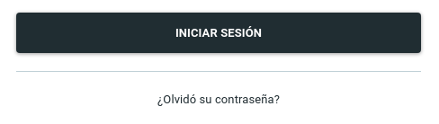

En la siguiente pantalla, verémos el proceso de registro a la web, accediendo desde el menú de la barra superior, en la parte derecha "Registrarse".

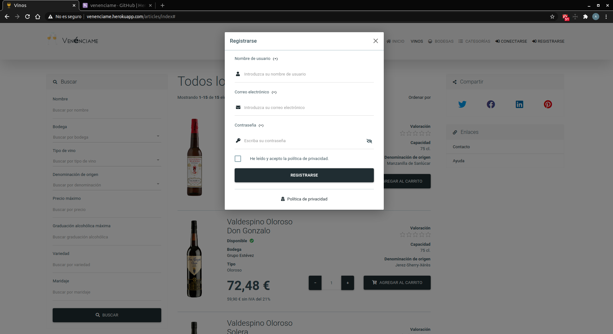

En el proceso de registro, se llevará a cabo una validación por correo electrónico.

Una vez conectados, accederemos a la pantalla de inicio, que está dividida en dos partes: la parte central, en la cual verás los artículos, y en la parte derecha, una barra de navegacíon, en la cual podrás tener acceso a tu carrito de la compra, enlaces a distintos lugares de la aplicación, y por último, un enlace al formulario de solicitud de socios de la web, el cual siempre estará presente mientras no seas socio.

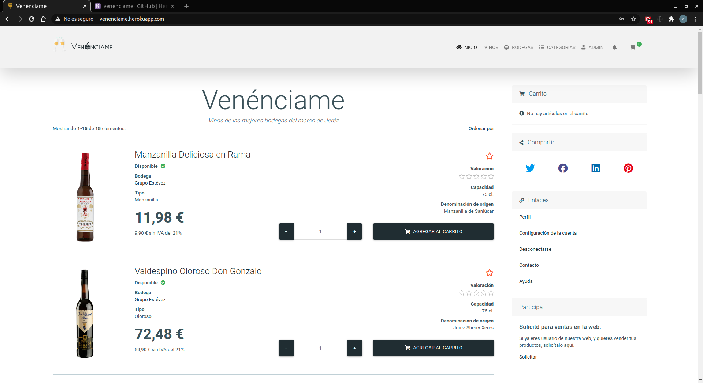

En la sección de vinos, que se accede desde el menú superior derecho, en el enlace "Vinos", tendremos tres espacios destacados: el central, que es donde se muestran los artículos; el izquierdo: donde tendremos un menú de opciones de dfiltrado y en la parte derecha, la barra de navegación.

En la lista de artículos (la posición central), podemos acceder a los artículos individualmente, haciendo clic el nombre del artículo. Tambien podemos seleccionar directamente la cantidad de articulos (+/-) y agregarlos al carrito de la compra desde el botón "Agregar al carrito".

Si desea agregar el artículo a favoritos, sólo tiene que pulsar la pequeña estreña anaranjada de la parte superior derecha del articulo.

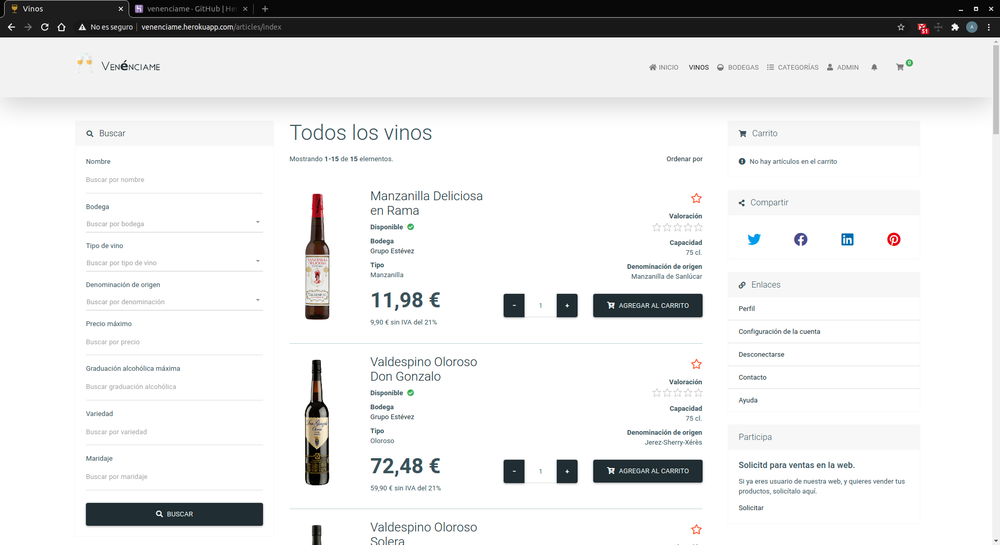

Cuando hacemos clic en el nombre del artículo, nos llevará a una vista más detallada.

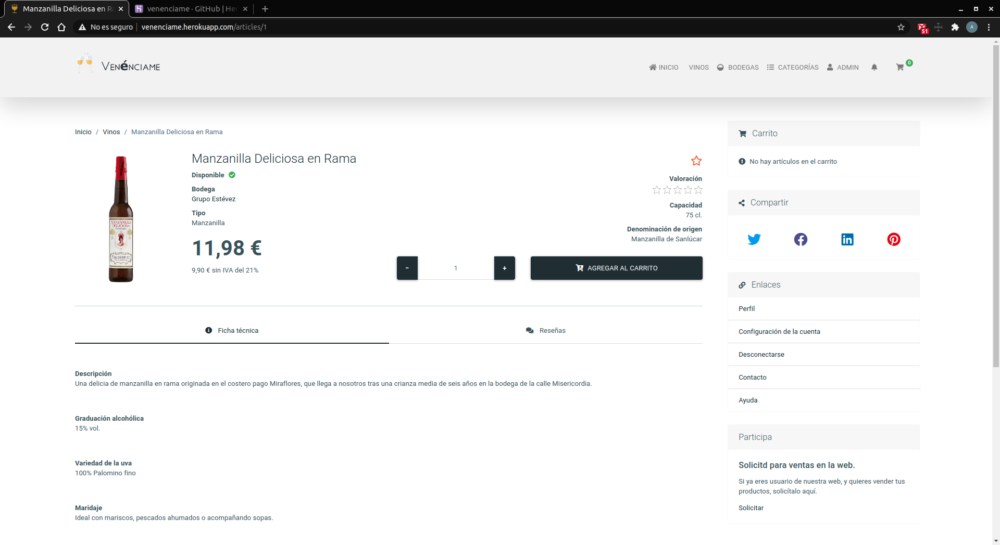

En dicha vista, podrás ver los mismos elementos que la figura anterior, destacando a parte, las secciones de "Ficha técnica" y "Reseñas" en las cuales podrás acceder a información detallada del producto, y si eres usuariuo registrado, podrás dejar reseñas y valoraciones de los artículos.

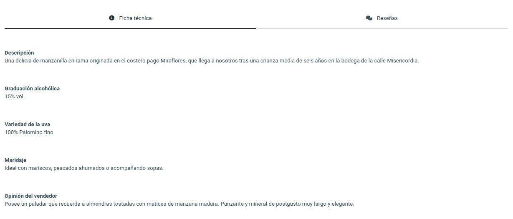

Agregar una reseña: 
Podemos comentar y valorar desde las estrellas de la parte superior derecha de la ventana emergente.

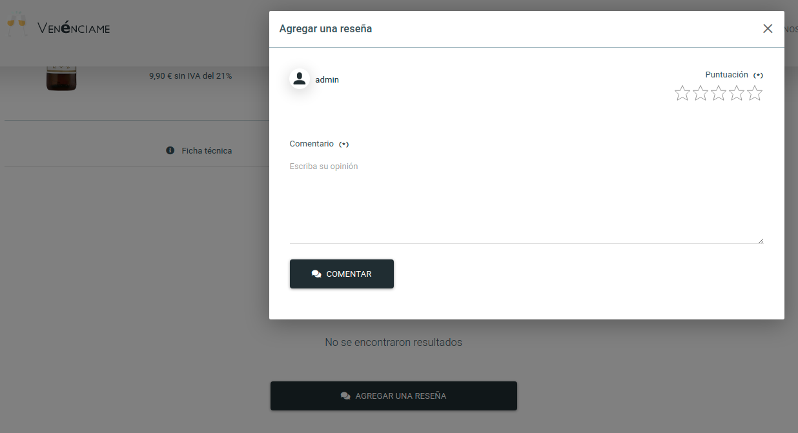

Si eres el creador del artículo o administrador, podrás acceder a la edición o eliminación del artículo desde la parte inferior izquierda de la ventana en los botones "Editar artículo" y "Eliminar artículo"

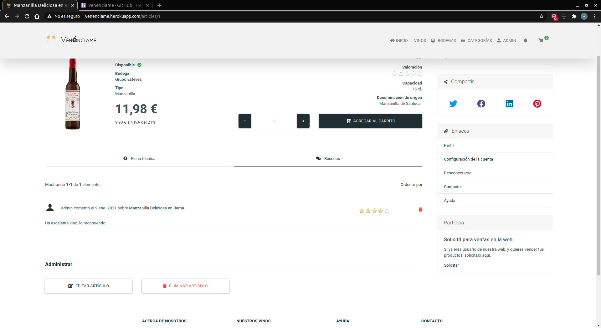

Al agregar un artículo al carrito de la compra, podremos ver en la barra de navegación de la derecha, en la parte superior, en la sección "Carrito" los artículos de tu carrito, asimismo, podrás acceder a información mas detallada del carrito, pulsando el botón "Realizar compra", así como el botón de la parte superior derecha de la barra de navegación superior con forma de carrito, asi también la cantidad de artículos en el carrito.

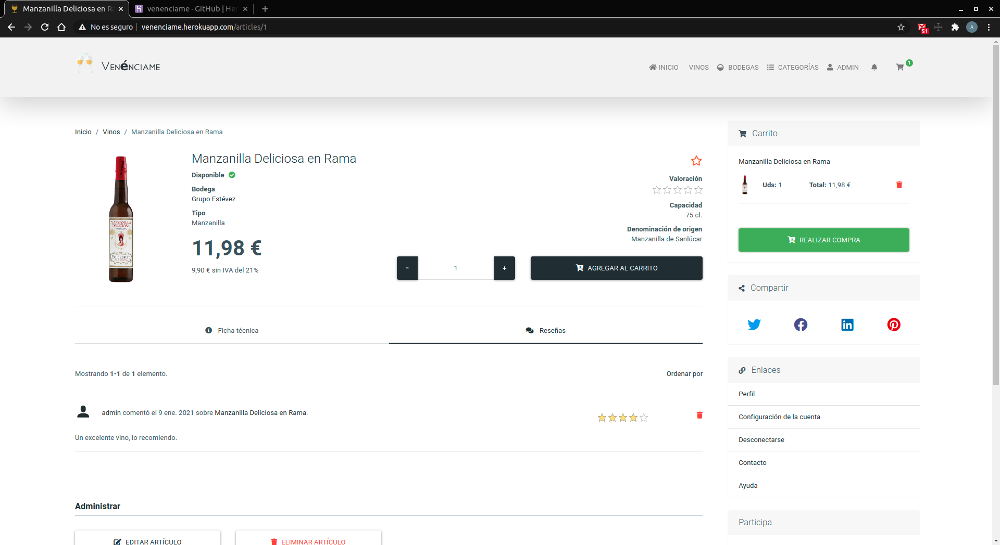

Vista detallada del carrito:
En esta sección se tiene 2 opciones, a pasar por caja mediante PayPal o seguir comprando.

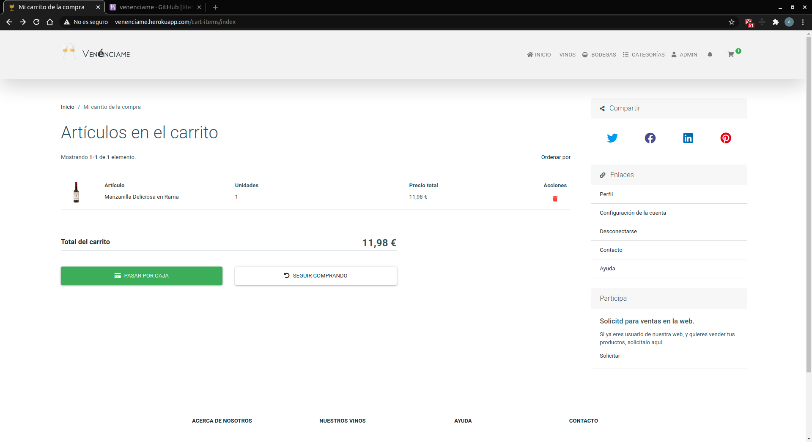

Vista de perfil de usuario:
En esta vista, podemos acceder a distintos lugares de nuestro perfil, desde las pestañas "Actividad", "Seguidos", "Favoritos", "Compras".
Se puede acceder a ella desde la barra de navegación superior, en el menú que lleva el nombre de su usuario.

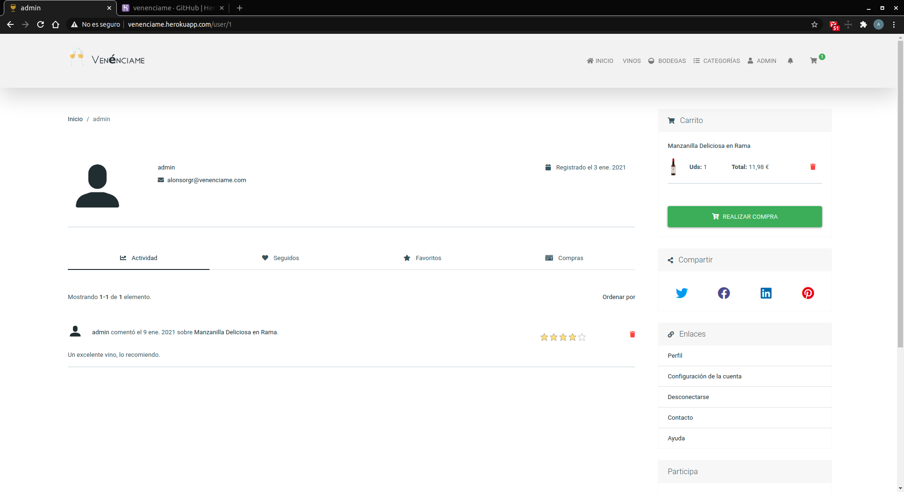

Bodegas (barra de navegación de la derecha, en la parte superior).

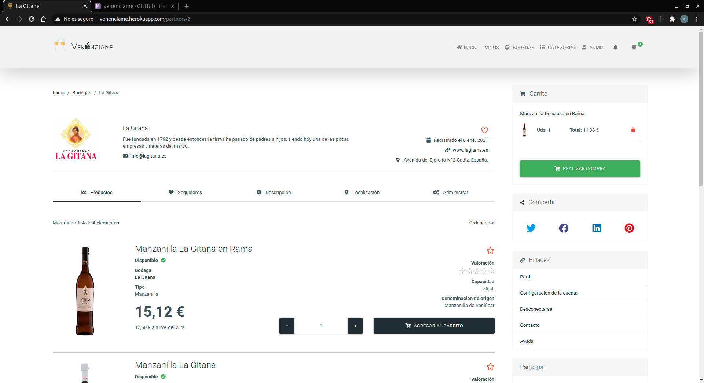

Panel de administración.

